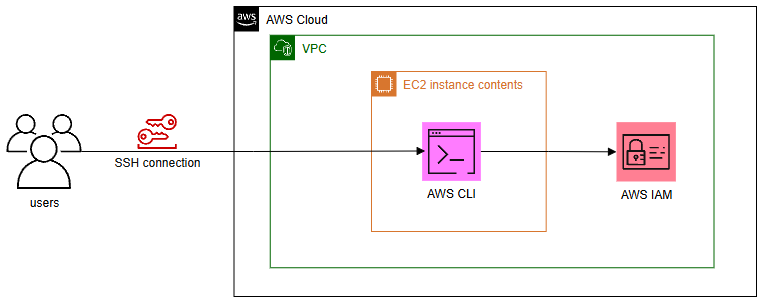
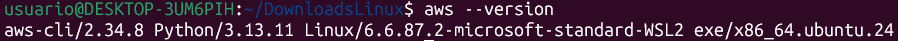
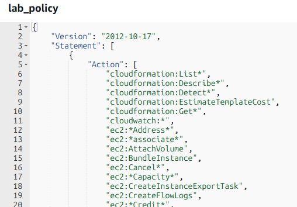
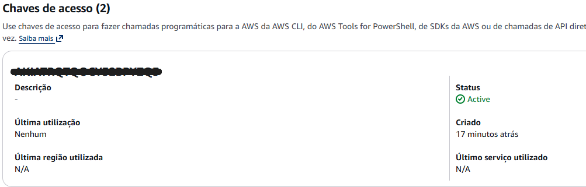
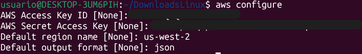
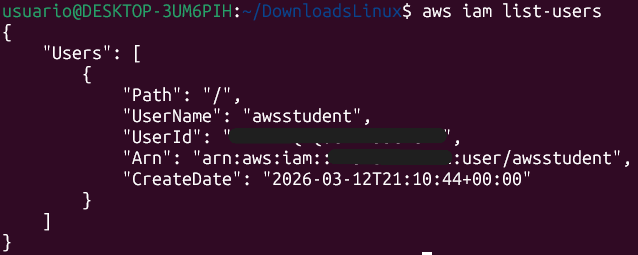
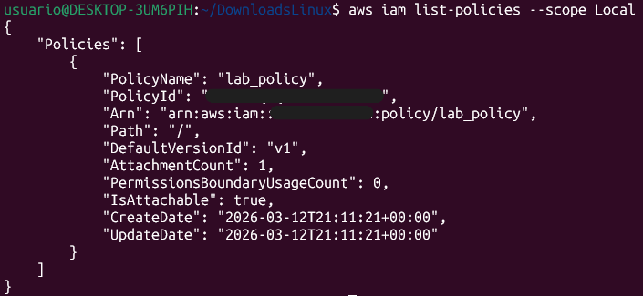
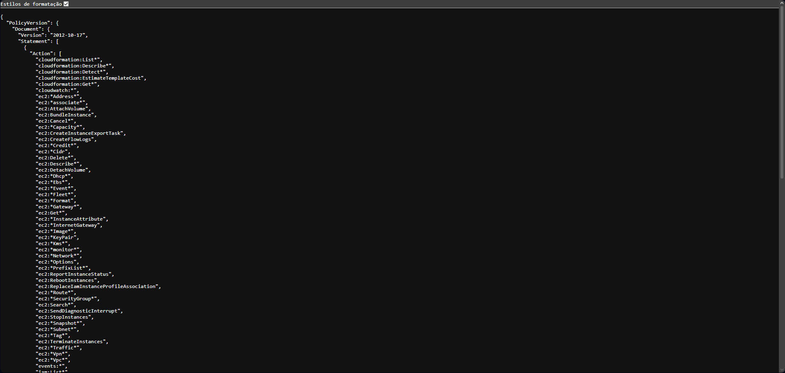
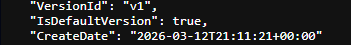

# Instalar e Configurar a AWS CLI em uma Instância EC2 (Red Hat)


## Visão geral

Neste laboratório pratiquei a conexão com uma instância EC2 Linux usando SSH e realizei a instalação do AWS CLI em uma instância Red Hat que não possuía a ferramenta instalada por padrão.

Após instalar o AWS CLI, configurei o acesso à minha conta AWS utilizando **Access Key** e **Secret Access Key**, permitindo executar comandos AWS diretamente pela linha de comando.

Durante o laboratório também explorei usuários e políticas do **AWS IAM**, além de utilizar comandos da AWS CLI para listar usuários da conta.

---

## Arquitetura do laboratório



A arquitetura consiste em uma instância **Amazon EC2 (Red Hat Linux)** acessada via **SSH**, onde foi instalado o **AWS CLI** para interação com serviços da AWS através da linha de comando.

---

## Serviços utilizados

- Amazon EC2
- AWS Identity and Access Management (IAM)
- AWS Command Line Interface (AWS CLI)

---

## Ambiente utilizado

Durante o laboratório utilizei:

- **Windows Subsystem for Linux (WSL)**
- **Ubuntu**
- Terminal Linux
- AWS CLI
- Instância Amazon EC2 (Red Hat)

---

## Etapas do laboratório

### 1. Conexão com a instância EC2

O primeiro passo do laboratório foi estabelecer uma conexão com uma instância EC2 executando Red Hat Linux.

Para isso utilizei o **WSL (Windows Subsystem for Linux)** com a distribuição **Ubuntu**, o que me permitiu trabalhar diretamente com ferramentas Linux no terminal.

Após baixar o arquivo de chave fornecido pelo laboratório, ajustei as permissões do arquivo utilizando o comando:

```bash
chmod 400 labsuser.pem
```

Em seguida utilizei o SSH para conectar na instância EC2:

```bash
ssh -i labsuser.pem ec2-user@<ip-publico>
```

### 2. Instalação do AWS CLI na instância EC2

Depois de acessar a instância EC2 com sucesso, o próximo passo foi instalar o **AWS Command Line Interface (AWS CLI)** na instância Linux Red Hat, pois essa ferramenta não estava instalada por padrão.

Primeiro realizei o download do instalador utilizando o comando `curl`, salvando o arquivo no diretório atual da instância:

```bash
curl "https://awscli.amazonaws.com/awscli-exe-linux-x86_64.zip" -o "awscliv2.zip"
```
Em seguida, descompactei o arquivo utilizando o comando:

```bash
unzip -u awscliv2.zip
```

Após extrair o conteúdo, executei o instalador da AWS CLI utilizando permissões administrativas:

```bash
sudo ./aws/install
```

Para confirmar se a instalação havia sido realizada corretamente, verifiquei a versão instalada com o comando:

```bash
aws --version
```
Saída na linha de comando:



### 3. Análise das configurações do IAM no Console AWS

Depois de instalar o AWS CLI, explorei o serviço AWS Identity and Access Management (IAM) diretamente pelo Console de Gerenciamento da AWS.

No console, pesquisei por IAM e acessei a seção Users para visualizar o usuário awsstudent.

Dentro da página do usuário, observei duas informações importantes:

Política de permissões

Na aba Permissions, visualizei a política chamada lab_policy. Ao abrir o documento no formato JSON, consegui ver exatamente quais permissões estavam sendo concedidas ao usuário.



Esse documento define quais ações o usuário pode executar dentro da conta AWS.

Credenciais de segurança

Na aba Security credentials, localizei o Access Key ID associado ao usuário. Essa chave é utilizada para autenticar aplicações externas, como o AWS CLI.



### 4. Configuração do AWS CLI para acessar a conta AWS

Com o AWS CLI instalado, configurei a ferramenta para conectar a instância EC2 à conta AWS.

Para isso executei o comando:

```bash
aws configure
```

Durante a configuração, informei os seguintes dados:

```
AWS Access Key ID
AWS Secret Access Key
Região padrão: us-west-2
Formato de saída: json
```
Configuração das credenciais AWS no terminal:



Essas informações permitem que o AWS CLI se autentique na conta AWS e execute comandos autorizados pelo IAM.

### 5. Consultar informações do IAM usando AWS CLI

Depois de configurar o AWS CLI, testei a conexão executando o seguinte comando:

```bash
aws iam list-users
```

Esse comando retornou uma resposta no formato JSON, contendo a lista de usuários IAM presentes na conta AWS.



Essa etapa demonstrou que o AWS CLI estava corretamente configurado e que eu possuía permissão para consultar informações do IAM.

---

## Desafio — Exportar uma política IAM usando AWS CLI

Como desafio final, precisei recuperar a política lab_policy diretamente pela linha de comando, sem utilizar o console.

Primeiro listei as políticas gerenciadas localmente na conta:

```bash
aws iam list-policies --scope Local
```

Saída na linha de comando:



Depois utilizei o ARN da política para obter sua versão e salvar o documento em um arquivo JSON:

```bash
aws iam get-policy-version --policy-arn arn:aws:iam::099999999999:policy/lab_policy --version-id v1 > lab_policy.json
```

Esse comando redirecionou a saída do terminal para o arquivo lab_policy.json.

Arquivo lab_policy.json:



No final do arquivo `lab_policy.json` é possível identificar o `VersionId` da política recuperada anteriormente via linha de comando.



---

## Aprendizados do laboratório

Durante este laboratório desenvolvi conhecimentos práticos sobre administração de ambientes Linux na AWS e gerenciamento de identidades utilizando o IAM. Os principais aprendizados foram:

### 1. Acesso e operação em instâncias Linux
- Conectar-se a uma instância **Amazon EC2** utilizando **SSH**.
- Trabalhar com um ambiente Linux remoto para executar tarefas administrativas.
- Compreender a importância das permissões de arquivos ao utilizar chaves de acesso.

### 2. Instalação e gerenciamento de software no Linux
- Instalar manualmente ferramentas em um servidor Linux.
- Utilizar o comando `curl` para baixar arquivos diretamente pela linha de comando.
- Utilizar `sudo` para executar comandos com privilégios administrativos.
- Verificar se uma aplicação foi instalada corretamente utilizando comandos de validação.

### 3. Configuração e uso da AWS CLI
- Instalar e configurar a **AWS Command Line Interface (AWS CLI)** em uma instância EC2.
- Configurar credenciais de acesso utilizando **Access Key** e **Secret Access Key**.
- Compreender como a AWS CLI armazena credenciais localmente para autenticação.

### 4. Fundamentos de segurança com IAM
- Entender como usuários IAM recebem permissões através de **políticas de acesso**.
- Analisar políticas IAM estruturadas em **formato JSON**.
- Compreender a diferença entre:
  - **Autenticação no Console AWS** (usuário e senha)
  - **Autenticação programática** (Access Key e Secret Key)

### 5. Interação com serviços AWS via linha de comando
- Utilizar a AWS CLI para consultar recursos da AWS.
- Listar usuários IAM utilizando comandos da CLI.
- Consultar políticas de acesso diretamente pelo terminal.

### 6. Manipulação de dados e automação
- Interpretar respostas retornadas pela AWS CLI em **formato JSON**.
- Utilizar redirecionamento de saída (`>`) para salvar informações do terminal em arquivos.
- Exportar uma política IAM para um arquivo JSON local utilizando comandos da AWS CLI.

---

## Resultados obtidos

Ao final do laboratório consegui realizar com sucesso as seguintes atividades:

- Conectar-me a uma instância **Amazon EC2** utilizando SSH.
- Instalar e validar a instalação da **AWS CLI** em um ambiente Linux.
- Configurar credenciais AWS para autenticação programática.
- Consultar usuários do **IAM** diretamente pela linha de comando.
- Exportar uma política de acesso IAM em formato **JSON**.
- Compreender como o **IAM controla o acesso aos recursos dentro de uma conta AWS**.