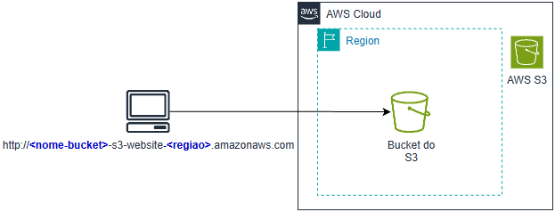
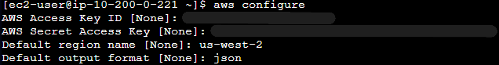
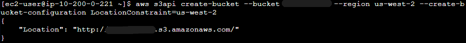
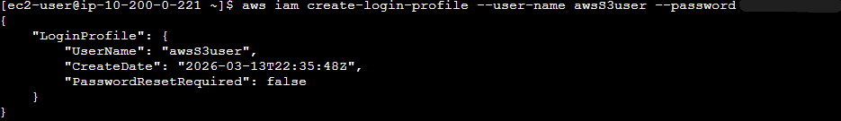
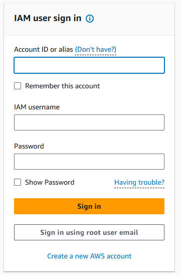
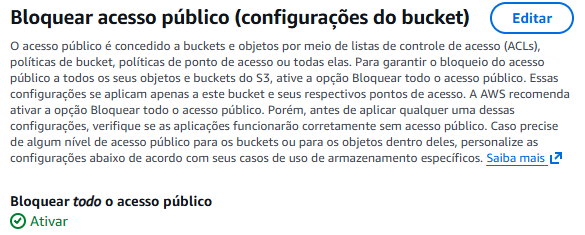
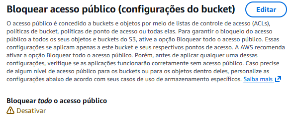
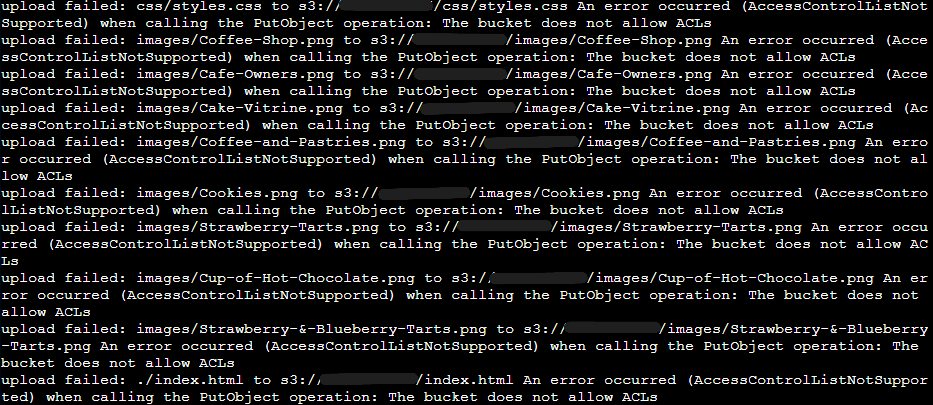
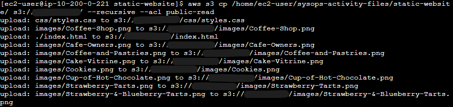

# Hospedagem de Site Estático no Amazon S3 usando AWS CLI


---

# Visão geral

Neste laboratório implementei a hospedagem de um site estático no Amazon S3 utilizando principalmente a AWS CLI para criação e gerenciamento dos recursos. A partir de uma instância Linux acessada pelo AWS Systems Manager Session Manager, configurei as credenciais da AWS, criei um bucket no S3 e preparei os arquivos do site para publicação.

Durante o processo, também utilizei comandos da CLI para criar um usuário IAM, ajustar permissões do bucket e habilitar acesso público aos objetos hospedados. Após preparar os arquivos do site no ambiente Linux, realizei o upload para o bucket e configurei o S3 para servir o index.html como página inicial.

Por fim, criei um script Bash para automatizar o envio de novas versões do site para o S3, permitindo atualizar o conteúdo publicado de forma rápida e repetível.

---

# Arquitetura do laboratório



---

## Serviços utilizados

- Amazon S3
- AWS IAM
- AWS Systems Manager (SSM)
- AWS Session Manager 
- CLI

---

## Ambiente utilizado

Durante o laboratório utilizei:

- AWS Session Manager para conectar com a Instância do EC2 (link provisionado pelo laboratório)
- Linux
- HTML
- Bash Script
- Bucket do S3
- Comando CLI do IAM e S3

---

## Etapas do laboratório

### 1. Conexão com Instância Linux do EC2 com SSM

Após me conectar atraves do URL disponbilizado pelo laboratorio, executei como superusuario para retornar ao usuario padrao e em seguida troquei o usuario para o usuario do ec2. 

```bash
sudo su -l ec2-user
```

Para confirmação de local e usuario, dei o comando

```bash
pwd
```

### 2. Configuração do AWS CLI

 configurei a ferramenta para conectar a instância EC2 à conta AWS.

Para isso executei o comando:

```bash
aws configure
```

Durante a configuração, informei os seguintes dados:

```
AWS Access Key ID
AWS Secret Access Key
Região padrão: us-west-2
Formato de saída: json
```
Configuração das credenciais AWS no terminal:



### 3. Criação do Bucket do S3 usando CLI

Para criação do bucket do S3, para que por padrão o bucket não fosse criado na Região `us-east-1`, especifiquei a região com:

```bash
--region us-west-2
```
E para garantir que a criação na Região que defini, usei um comando para forçar a criação na Região `us-west-2`:

```bash
--create-bucket-configuration LocationConstraint=us-west-2
```

Comando completo para criação do bucket do S3 no cenário da solução:

```bash
aws s3api create-bucket --bucket <nome-bucket> --region us-west-2 --create-bucket-configuration LocationConstraint=us-west-2
```

Saída no CLI:



### 4. Criação de usuário do IAM usando CLI

Nessa etapa, usando o CLI, criei um usuário do IAM para a conta da AWS.

```bash
aws iam create-user --user-name <nome-usuario-que-deseja>
```

Agora, ainda no CLI, criei uma perfil de login para o usuário criado anteriomente.

```bash
aws iam create-login-profile --user-name <nome-usuario> --password <senha-que-deseja>
```

Saínda no CLI:



Ao final dessa etapa, um usuário do IAM consegue fazer Login em uma conta AWS. 

Para isso, existem 3 informações necessárias que o usuário tem que informar, são elas:

1. ID da Conta
2. Username IAM
3. Password 

Anteriormente criamos o username e password. Para o ID da conta, ela é criada aleátoriamente para no momento que um usuário do IAM é criado.

Tela de login para usuários do IAM com perfil de login criado.



### 5. Ajuste de permissões do Bucket do S3

Nessa etapa, realizei algumas configurações diretamente no Console de Gerenciamento da AWS.

Acesso público bloqueado (Antes).



Acesso público desbloqueado (Depois).




Obs:
também foi alterado o ACL (Lista de Controle de Acesso), o ACL foi habilitado para que os objetos no bucket do S3 pudessem ser propriedade de outra conta da AWS. Caso não seja feito, o upload de um arquivo em um bucket do S3 irá falhar.




### 6. Extraindo arquivo `static-website`

Agora, para extrair o arquivo `static-website`, que possui arquivos `HTML` e `CSS` e imagens, é preciso acessar o diretório onde o arquivo está localizado, extrair o conteúdo do arquivo e entrar na pasta raiz do site estático

Para isso, usei o CLI para realizar essa etapa.

1. Acessando uma pasta específica dentro do diretório `/home/ec2-user`

```bash
cd ~/sysops-activity-files
```
2. Extração do contéudo do arquivo e descompactamento do arquivo (.tar.gz)

```bash
tar xvzf static-website-v2.tar.gz
```
3. Acessar a pasta raíz 

```bash
cd static-website
```

Como resultado, os arquivos foram extraidos com sucesso e estão pronto para upload para o Amazon S3.


### 7. Fazendo upload do arquivo para o S3 usando CLI

Antes de realizar o uploado do arquivo, é preciso definir o documento índice, para garantir que um arquivo index.html seja executado sempre quem um novo usário final acessar o site.

```bash
aws s3 website s3://<nome-bucket>/ --index-document index.html
```

Com isso, a etapa de upload é possível.

```bash
aws s3 cp /home/ec2-user/sysops-activity-files/static-website/ s3://<nome-bucket>/ --recursive --acl public-read
```

 O parâmetro de ACL `--acl public-read`, especifica que os arquivos carregados tenham acesso público de leitura.
 
 O parâmetro `--recursive`, indica que é necessário fazer upload de todos os arquivos no diretório atual na máquina.

 

 Agora, o site estático está hospedado no Amazon S3.

 
 

### 8. Criação de arquivo em lote para implantação repetível

Nesta etapa criei um **script Bash** para automatizar o processo de envio dos arquivos do site para o Bucket no **Amazon S3**.  
Com esse script, sempre que houver alterações nos arquivos do site, posso atualizar o conteúdo publicado executando apenas um comando no terminal.

Para isso, criei um novo arquivo `.sh` no diretório raiz.

```bash
touch update-website.sh
```

Com o arquivo criado, usando o editor `VI`, executei o comando bash para copiar os arquivos do diretório do site para o bucket do S3 de forma recursiva, mantendo o site atualizado.

```bash
#!/bin/bash 
aws s3 cp /home/ec2-user/sysops-activity-files/static-website/ s3://<nome-bucket>/ --recursive --acl public-read
```

Depois transformei o arquivo em um arquivo bash executável

```bash
chmod +x update-website.sh
```

Por fim com o editor `VI`, fiz algumas alterações no documento de índice `html.index`, e executei o script para enviar os arquivos atualizados para o bucket do S3.

```bash
./update-website.sh
```

Website estático após as alterações

 

---

## Aprendizados do laboratório

Durante este laboratório desenvolvi conhecimentos práticos sobre **implantação de sites estáticos na AWS utilizando o Amazon S3 e automação com AWS CLI**. Os principais aprendizados foram:

### 1. Uso da AWS CLI para gerenciamento de recursos
Aprendi a utilizar comandos da **AWS CLI** para criar e gerenciar recursos na AWS diretamente pelo terminal, incluindo a criação de buckets no S3 e usuários no IAM.

### 2. Criação e configuração de buckets no Amazon S3
Compreendi como criar um bucket especificando a **região da AWS** e como utilizar parâmetros adicionais para garantir que o recurso seja provisionado corretamente.

### 3. Gerenciamento de identidades e acesso com IAM
Criação de **usuários IAM** e configuração de **perfil de login** .

### 4. Controle de permissões e acesso público no S3
Aprendi a ajustar as configurações de **acesso público do bucket**, além de compreender o funcionamento das **ACLs (Access Control Lists)** para permitir leitura pública dos objetos hospedados.

### 5. Manipulação de arquivos no Linux para implantação de aplicações
Utilizei comandos do **terminal Linux** para navegar entre diretórios, extrair arquivos compactados (`.tar.gz`) e preparar a estrutura do site antes do envio para o S3.

### 6. Automação de implantação utilizando script Bash
Criei um **script Bash** para automatizar o processo de atualização do site, permitindo enviar rapidamente novas versões dos arquivos para o bucket do S3 com apenas um comando.

---

## Resultados obtidos

Ao final do laboratório consegui realizar com sucesso as seguintes atividades:

- Conectar a uma instância **Amazon EC2** utilizando **AWS Session Manager do AWS Systems Manager**.
- Configurar a **AWS CLI** para autenticação na conta AWS.
- Criar um **bucket no Amazon S3** utilizando comandos da CLI.
- Criar um **usuário IAM** e configurar seu acesso usando AWS CLI.
- Ajustar permissões de acesso público e habilitar **ACLs** para objetos do bucket.
- Extrair e preparar os arquivos de um **site estático** em ambiente Linux.
- Fazer upload dos arquivos do site para o **Amazon S3** utilizando AWS CLI.
- Configurar o bucket para **hospedagem de site estático** com documento de índice.
- Criar um **script Bash automatizado** para atualizar o site de forma rápida e repetível.
- Publicar e atualizar um **site estático acessível pela internet através do endpoint do S3**