# Auto Scaling com Application Load Balancer na AWS


---

## Visão geral

Neste laboratório implementei uma arquitetura escalável na AWS utilizando **Amazon EC2**, **Auto Scaling** e **Application Load Balancer (ALB)**.

O objetivo foi construir uma infraestrutura capaz de **se adaptar automaticamente à demanda**, garantindo que uma aplicação continue disponível mesmo quando o número de acessos aumenta ou diminui.

Na prática, isso significa que:
- Quando muitos usuários acessam o sistema, novas máquinas são criadas automaticamente para suportar a carga.
- Quando o acesso diminui, as máquinas excedentes são removidas, evitando desperdício de recursos.

Durante o processo, utilizei a **AWS CLI** para criar uma instância EC2 com **Amazon Linux**, configurada automaticamente por meio de um script **User Data**, que instala e inicia um servidor web.

A partir dessa instância, gerei uma **AMI (Amazon Machine Image)** personalizada. Essa imagem funciona como um “modelo pronto”, permitindo criar novas instâncias idênticas de forma rápida e padronizada.

Em seguida:

- Configurei um **Application Load Balancer**, responsável por distribuir o tráfego entre múltiplas instâncias.
- Criei um **Launch Template**, que define como novas instâncias devem ser iniciadas.
- Configurei um **Auto Scaling Group**, que controla automaticamente a quantidade de instâncias com base no uso de CPU monitorado pelo **Amazon CloudWatch**.

Ao final, compreendi como os serviços da AWS trabalham juntos para criar sistemas **resilientes, automáticos e altamente disponíveis**, sem necessidade de intervenção manual constante.

---

## Arquitetura

Arquitetura **antes** da implementação do Auto Scaling:

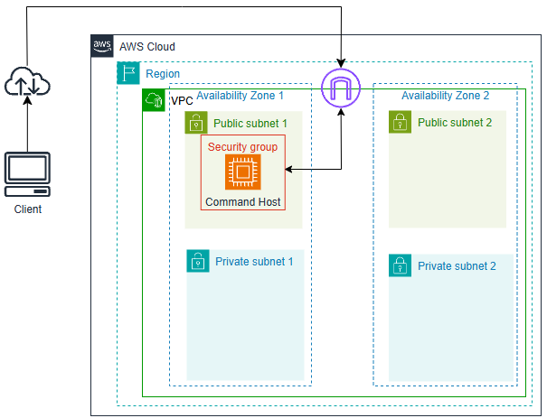

Arquitetura **depois** da implementação do Auto Scaling:

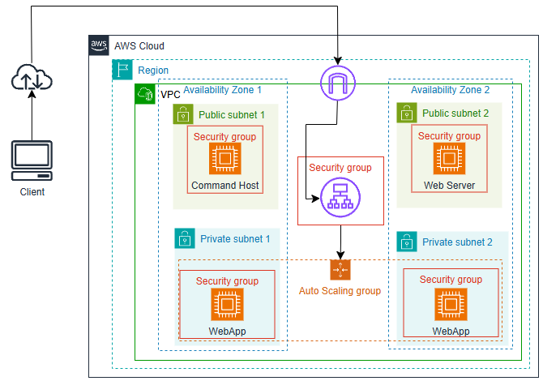

---

## Serviços utilizados

- **Amazon EC2** → criação e execução das máquinas virtuais
- **Amazon EC2 Auto Scaling** → ajuste automático da quantidade de instâncias
- **Application Load Balancer (ALB)** → distribuição inteligente do tráfego
- **AWS CLI** → automação via linha de comando
- **Amazon VPC** → rede isolada na nuvem
- **Security Groups (Grupos de Segurança)** → controle de acesso às instâncias
- **Amazon CloudWatch** → monitoramento de métricas (CPU)

---

## Ambiente utilizado

- Instância **Command Host (EC2)**
- AWS CLI pré-configurada
- Linux (Amazon Linux)
- Script **User Data**
- Aplicação Web em PHP
- Sub-redes públicas e privadas

---

## Etapas do laboratório

### 1. Conexão com a instância Command Host

Conectei à instância EC2 utilizando **EC2 Instance Connect** diretamente pelo console da AWS.

---

### 2. Configuração da AWS CLI

Configurei a AWS CLI para garantir que os comandos fossem executados na região correta.

```bash
aws configure
```

### 3. Criação de uma instância via CLI (Terminal Linux)

Utilizei um script User Data para criar automaticamente uma instância EC2 já configurada com um servidor web.

```bash
aws ec2 run-instances \
--key-name KEYNAME \
--instance-type t3.micro \
--image-id AMIID \
--user-data file:///home/ec2-user/UserData.txt \
--security-group-ids HTTPACCESS \
--subnet-id SUBNETID \
--associate-public-ip-address
```

Conteúdo do `UserData.txt`:  

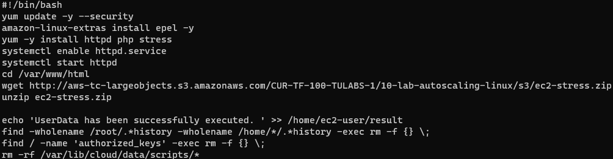

### 4. Criação de uma AMI personalizada

Criei uma imagem da instância configurada para reutilização no Auto Scaling. AMIs personalizadas garantem padronização e rapidez na criação de novas instâncias.

```bash
aws ec2 create-image --name WebServerAMI --instance-id NEW-INSTANCE-ID
```

A confirmação da criação é feita pelo retorno do ID da imagem:

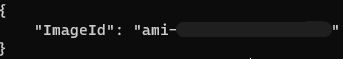

### 5. Criação do ambiente de Auto Scaling

#### 5.1 Application Load Balancer (ALB)

O Load Balancer distribui automaticamente as requisições entre várias instâncias, evitando sobrecarga em apenas uma máquina

- Mapeamento de rede:

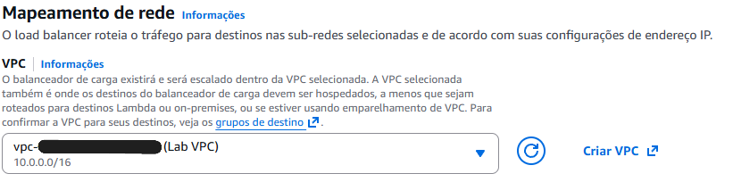

- Sub-redes públicas em duas AZs:

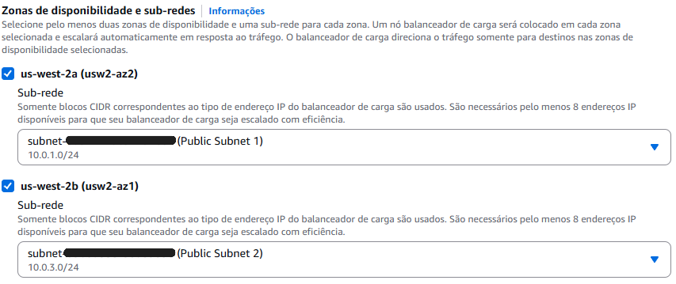

- Grupo de Segurança com acesso HTTP:

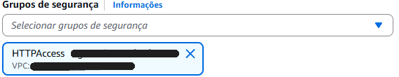

- Target Group com health check em `/index.php`:

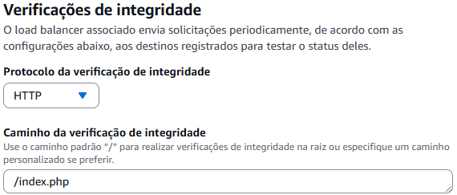

#### 5.2 Listener e roteamento

O Listener recebe as requisições (porta HTTP) e encaminha para as instâncias corretas.

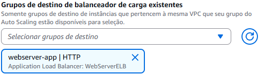

#### 5.3 Verificação de integridade (Health Check)

O ALB (Application Load Balancer) verifica automaticamente se as instâncias estão funcionando corretamente.

Se uma instância falhar:

- Ela deixa de receber tráfego
- Pode ser substituída automaticamente


#### 5.4 Verificação de integridade do ELB (Elastic Load Balancer)

Essa verificação permite identificar instâncias com problemas e substituí-las automaticamente.

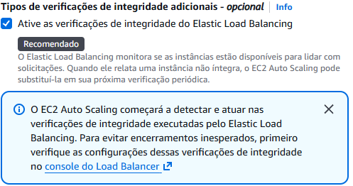

### 6. Criação do Launch Template (Modelo de execução)

Criei um modelo que define como novas instâncias devem ser criadas:

AMI: WebServerAMI  
Tipo: t3.micro  
Grupo de Segurança: HTTPAccess (grupo de segurança criado pelo próprio laboratório)

- Opção da AMI personalizada no Console de Gerenciamento AWS:

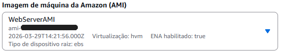

- Instância criada com a AMI personalizada:  


### 7. Criação do Auto Scaling Group

Configurei o grupo com os seguintes parâmetros:

Capacidade mínima: 2  
Capacidade desejada: 2  
Capacidade máxima: 4  

Sub-redes privadas:

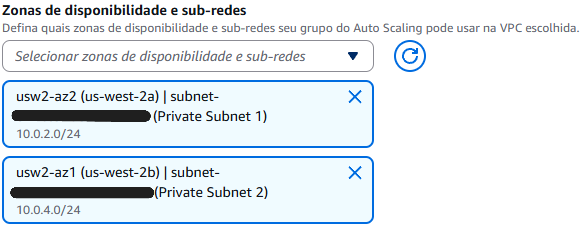  

Política de escalabilidade baseada em CPU:  

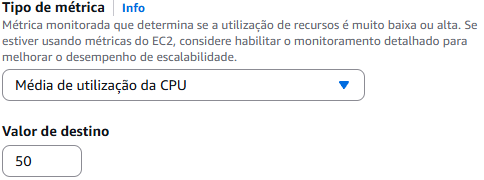

#### 7.1 Criação automática de instâncias

Assim que o grupo foi criado, o Auto Scaling iniciou automaticamente duas instâncias para atender à capacidade mínima definida.


## Aprendizados

Durante este laboratório desenvolvi conhecimentos práticos sobre como construir sistemas escaláveis e automatizados na nuvem.

Principais aprendizados:

- Automatização da criação de servidores com User Data  
- Criação de AMIs para padronização de ambientes  
- Distribuição de tráfego com Load Balancer
- Uso do Auto Scaling para ajustar recursos automaticamente  Monitoramento com  CloudWatch para tomada de decisão automática
- Construção de arquiteturas resilientes e altamente disponíveis
## Resultados
 
Ao final do laboratório consegui:

- Criar uma instância EC2 com servidor web via AWS CLI
- Gerar uma AMI personalizada
- Configurar um Application Load Balancer
- Criar um Launch Template reutilizável
- Implementar um Auto Scaling Group em sub-redes privadas
- Configurar escalabilidade automática baseada em CPU
- Compreender como a AWS permite criar sistemas que se adaptam automaticamente à demanda, reduzindo custos e aumentando a disponibilidade