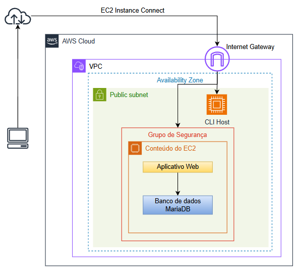
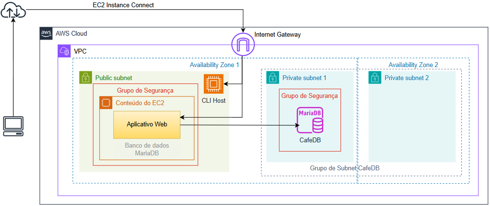
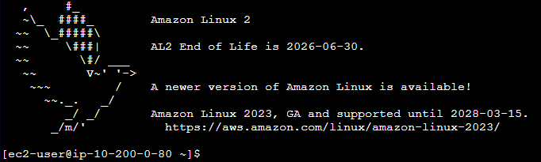
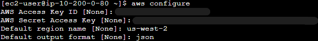
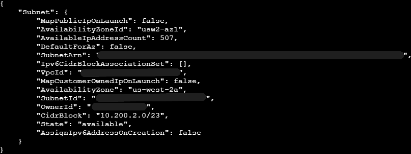
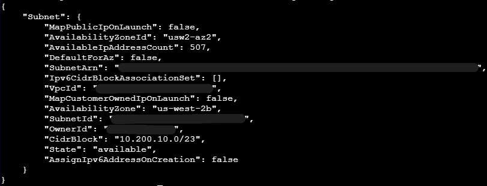
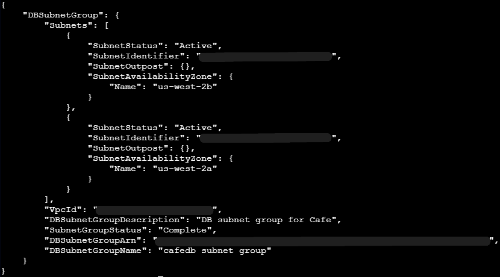
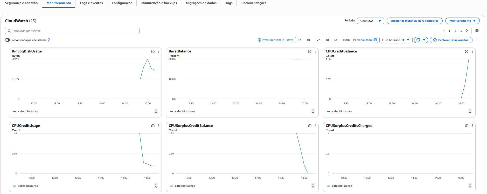

# Migração de Banco de dados para o Amazon RDS


---

## Visão geral

Neste laboratório, realizei a **migração de um banco de dados local para o Amazon RDS**, utilizando a AWS CLI e ferramentas nativas do MySQL.

O objetivo foi demonstrar como mover uma base de dados que está rodando em uma instância EC2 para um serviço gerenciado, mais seguro, escalável e de alta disponibilidade.

Durante o processo, criei toda a infraestrutura necessária para o banco de dados, incluindo:

- **Sub-redes privadas** para isolar o banco
- **Grupo de segurança** para controle de acesso
- **Instância do Amazon RDS (MariaDB)**

Em seguida, utilizei o utilitário **mysqldump** para exportar os dados do banco local e importá-los para o RDS.

Por fim, atualizei a aplicação para utilizar o novo banco e validei o funcionamento, além de monitorar métricas com o **Amazon CloudWatch**.

Esse fluxo mostra na prática como empresas migram bancos locais para soluções gerenciadas na nuvem, reduzindo esforço operacional e aumentando a confiabilidade.

---

## Arquitetura

Arquitetura antes da migração para o RDS:




Arquitetura depois da migração para o RDS:



A arquitetura demonstra:

- Uma instância EC2 com a aplicação web
- Um banco de dados Amazon RDS em sub-rede privada
- Comunicação segura entre EC2 e RDS via Security Group
- Monitoramento via CloudWatch
- Configuração dinâmica usando Systems Manager

---

## Serviços utilizados

- Amazon EC2
- Amazon RDS (MariaDB)
- Amazon VPC
- Security Groups
- AWS CLI
- AWS Systems Manager
- Amazon CloudWatch

---

## Ambiente utilizado

- Amazon Linux
- Terminal Linux (EC2 Instance Connect)
- MySQL / MariaDB
- AWS CLI

---

## Etapas do laboratório

### 1. Conexão com a instância CLI Host

Acessei a instância EC2 utilizando **EC2 Instance Connect**, que permite conexão direta pelo navegador sem necessidade de chave SSH local.



---

### 2. Configuração da AWS CLI

Configurei a AWS CLI com as credenciais do laboratório para executar comandos na AWS.

```bash
aws configure
```


---

### 3. Criação da infraestrutura do banco de dados
#### 3.1 Criação do Security Group

Criei um grupo de segurança para o banco de dados permitindo acesso apenas da aplicação:

```
aws ec2 create-security-group \
--group-name CafeDatabaseSG \
--description "Security group for Cafe database" \
--vpc-id <CafeInstance VPC ID>
```

Regra de entrada do grupo de segurnça:

```
aws ec2 authorize-security-group-ingress \
--group-id <CafeDatabaseSG Group ID> \
--protocol tcp --port 3306 \
--source-group <CafeSecurityGroup Group ID>
```

---

#### 3.2 Criação de sub-redes privadas

Criei duas sub-redes privadas para o banco de dados:

Sub-rede na zona de disponbilidade do CafeInstance:

```
aws ec2 create-subnet \
--vpc-id <CafeInstance VPC ID> \
--cidr-block 10.200.2.0/23 \
--availability-zone <CafeInstance Availability Zone>
```



Sub-rede em uma zona de disponibilidade diferente:

```
aws ec2 create-subnet \
--vpc-id <CafeInstance VPC ID> \
--cidr-block 10.200.10.0/23 \
--availability-zone <availability-zone>
```



---

#### 3.3 Criação do DB Subnet Group

Agrupei as sub-redes para uso no RDS:

```
aws rds create-db-subnet-group \
--db-subnet-group-name "CafeDB Subnet Group" \
--db-subnet-group-description "DB subnet group for Cafe" \
--subnet-ids <Cafe Private Subnet 1 ID> <Cafe Private Subnet 2 ID> \
--tags "Key=Name,Value= CafeDatabaseSubnetGroup
```

---

### 4. Criação da instância Amazon RDS

Criei uma instância MariaDB gerenciada:

```
aws rds create-db-instance \
--db-instance-identifier CafeDBInstance \
--engine mariadb \
--engine-version 10.5.13 \
--db-instance-class db.t3.micro \
--allocated-storage 20 \
--availability-zone <CafeInstance Availability Zone> \
--db-subnet-group-name "CafeDB Subnet Group" \
--vpc-security-group-ids <CafeDatabaseSG Group ID> \
--no-publicly-accessible \
--master-username root --master-user-password '*******'
```

Configurações principais:

- Engine: MariaDB
- Tipo: db.t3.micro
- Armazenamento: 20GB
- Acesso público: desabilitado

---

### 5. Migração do banco de dados
#### 5.1 Backup do banco local

Utilizei o mysqldump para exportar o banco:

```
mysqldump --user=root --password='*******' \
--databases cafe_db --add-drop-database > cafedb-backup.sql
```

---

#### 5.2 Importação para o RDS

Restaurei o banco no RDS:

```
mysql --user=root --password='*******' \
--host=<ENDPOINT_RDS> < cafedb-backup.sql
```

---

### 6. Atualização da aplicação

Utilizei o AWS Systems Manager Parameter Store para alterar a URL do banco:

Parâmetro: /cafe/dbUrl  
Novo valor: endpoint do RDS

Isso permite alterar configurações sem modificar o código da aplicação.

---

### 7. Monitoramento com CloudWatch

Acompanhei métricas do banco:




Isso permite identificar gargalos e garantir performance.

---

## Aprendizados

Durante este laboratório desenvolvi conhecimentos importantes sobre bancos de dados na AWS:

- Criação de banco gerenciado com Amazon RDS
- Isolamento de recursos com sub-redes privadas
- Controle de acesso com Security Groups
- Migração de banco usando mysqldump
- Atualização dinâmica de configuração com Parameter Store
- Monitoramento com CloudWatch

---

## Resultados

Ao final do laboratório consegui:

- Criar uma instância de banco de dados no Amazon RDS
- Migrar dados de um banco local para o RDS
- Conectar a aplicação ao novo banco
- Validar a integridade dos dados
- Monitorar o desempenho do banco na AWS