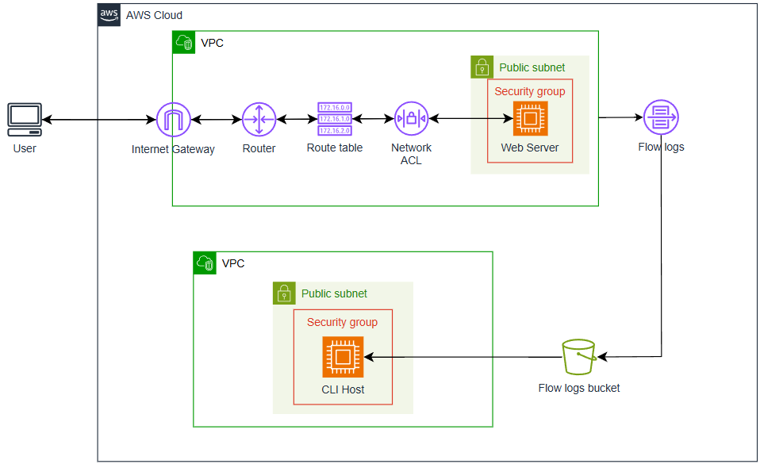
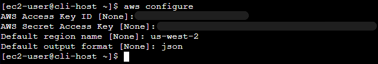
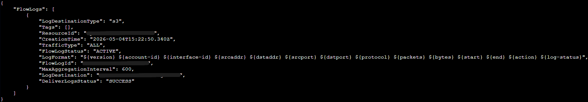
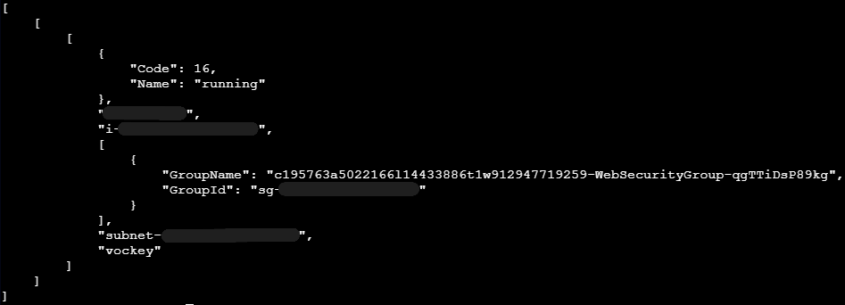
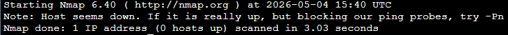
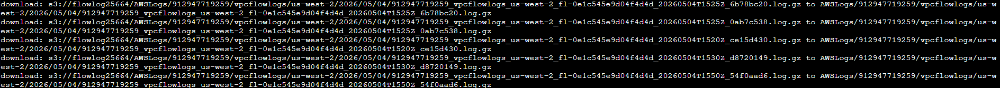
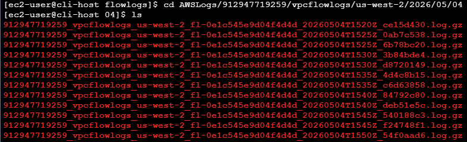
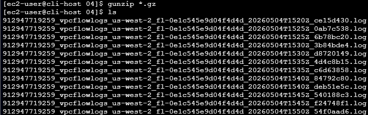
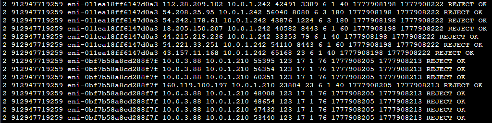

# Solucionando problemas de uma VPC


## Visão geral

Neste laboratório trabalhei com diagnóstico e resolução de problemas de rede na AWS, utilizando a AWS CLI e ferramentas de análise.

O objetivo foi identificar por que uma aplicação web hospedada em uma instância EC2 não estava acessível, mesmo estando em execução.

Esse tipo de cenário é muito comum no mundo real e mostra como pequenas configurações podem impactar totalmente o funcionamento de um sistema.

---

## Arquitetura




### 1. Conexão com a instância CLI Host

Conectei à instância utilizando EC2 Instance Connect, que permite acessar o terminal diretamente pelo navegador.

---

### 2. Configuração da AWS CLI

Configurei a AWS CLI com o comando:

```
aws configure
```



Essa etapa permite executar comandos e gerenciar recursos de forma automatizada.

---

### 3. Criação dos VPC Flow Logs

#### 3.1 Criando bucket no S3

Criei um bucket para armazenar os logs de rede:

```
aws s3api create-bucket --bucket flowlog###### --region us-west-2
```




#### 3.2 Ativando os logs da VPC

```
aws ec2 create-flow-logs \
--resource-type VPC \
--resource-ids <vpc-id> \
--traffic-type ALL \
--log-destination-type s3 \
--log-destination arn:aws:s3:::<bucket>
```

Os logs registram todo o tráfego da rede, permitindo identificar acessos permitidos e bloqueados.

---

### 4. Identificação do problema de acesso ao site

Ao acessar o IP público da instância, o site não carregava.


#### 4.1 Investigação

Utilizei comandos da AWS CLI para analisar a instância:

```
aws ec2 describe-instances
```



Fiz a instalação da ferramenta de rede `nmap` e executei o comando:

```
nmap <IP>
```

O resultado foi que nenhuma porta estava acessível:



---

### 5. Correção da tabela de rotas

Identifiquei que a sub-rede não possuía uma rota para o Internet Gateway.

Corrigi o problema adicionando uma rota para permitir acesso externo:

```
0.0.0.0/0 → Internet Gateway
```

Após essa correção, o site passou a ser acessível via navegador.


---

### 6. Download e análise dos logs

#### 6.1 Download dos logs

```
aws s3 cp s3://<bucket> . --recursive
```



#### 6.2 Visualização dos logs compactados



#### 6.2 Extração dos arquivos

Para analisar os logs, extraí os arquivos `.gz` com o comando:
```
gunzip *.gz
```


#### 6.3 Análise dos logs

Realizei a análise dos logs:



Os registros mostraram claramente tentativas de acesso sendo bloqueadas, ajudando a identificar os problemas de configuração

## Aprendizados

Durante este laboratório desenvolvi habilidades essenciais em redes na AWS.

Principais aprendizados:

- Como funciona o tráfego dentro de uma VPC
- Diferença entre Security Groups e Network ACL
- Importância das tabelas de rotas
- Uso de VPC Flow Logs para monitoramento
- Diagnóstico de problemas reais de conectividade
- Importância dos logs para identificar falhas invisíveis

## Resultados

Ao final do laboratório consegui:

- Criar e configurar VPC Flow Logs
- Armazenar logs no Amazon S3
- Identificar problemas de rede
- Corrigir rotas
- Analisar logs para entender falhas