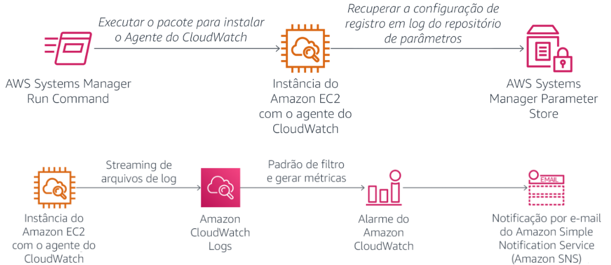
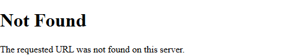
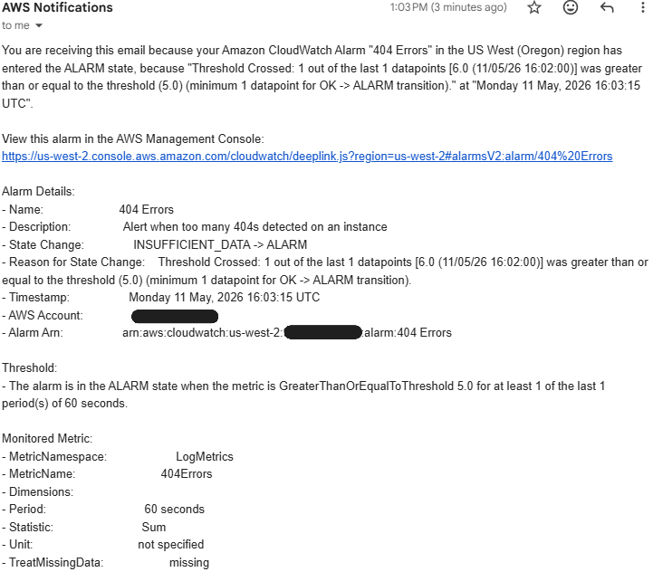
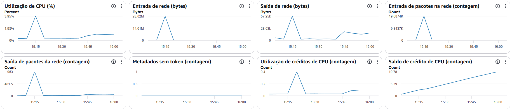
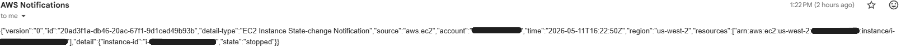
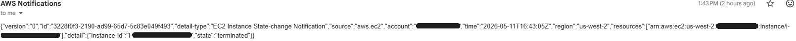
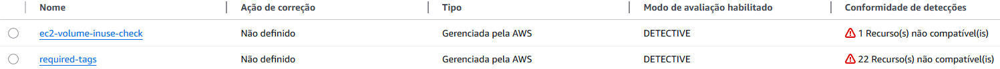
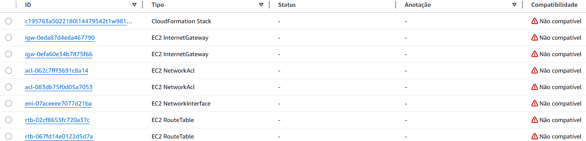
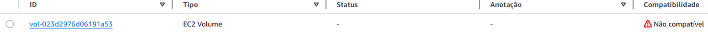

# Conformidade e Monitoramento da Infraestrutura


## Visão geral

Neste laboratório implementei uma solução de monitoramento e conformidade utilizando serviços da AWS para acompanhar métricas, logs e eventos de infraestrutura em tempo real.

O objetivo foi configurar uma estratégia completa de observabilidade para uma instância Amazon EC2 executando um servidor web Apache, utilizando recursos como o Amazon CloudWatch, CloudWatch Logs, CloudWatch Events, AWS Systems Manager e AWS Config.

Durante o processo instalei e configurei o CloudWatch Agent na instância EC2 utilizando o AWS Systems Manager Run Command. O agente foi configurado para coletar logs do Apache e métricas do sistema operacional, como uso de CPU, memória, disco e swap.

Também configurei filtros de métricas e alarmes no CloudWatch para identificar erros HTTP 404 automaticamente e enviar notificações via Amazon SNS sempre que o limite definido fosse atingido.

Além do monitoramento, utilizei o AWS Config para validar conformidade da infraestrutura, verificando recursos sem tags obrigatórias e volumes EBS não utilizados.

Ao final do laboratório foi possível monitorar logs da aplicação em tempo real, acompanhar métricas detalhadas da instância e receber alertas automáticos sobre alterações e problemas na infraestrutura.

## Diagrama



## Serviços utilizados
- Amazon EC2
- Amazon CloudWatch
- Amazon CloudWatch Logs
- Amazon CloudWatch Events
- AWS Systems Manager
- AWS Config
- Amazon SNS

### 1. Instalação do CloudWatch Agent

Inicialmente utilizei o AWS Systems Manager Run Command para instalar o agente do CloudWatch na instância EC2.

Documento utilizado:

| Configuração | Valor |
|---|---|
| Documento | AWS-ConfigureAWSPackage |
| Ação | Install |
| Pacote | AmazonCloudWatchAgent |
| Versão | latest |

A instalação foi executada na instância:

| Instância |
|---|
| Web Server |

### 2. Configuração do CloudWatch Agent

Depois da instalação configurei o agente utilizando o AWS Systems Manager Parameter Store.

Parâmetro criado:

| Configuração | Valor |
|---|---|
| Nome | Monitor-Web-Server |
| Descrição | Collect web logs and system metrics |

O parâmetro armazenou a configuração responsável por:

- Coletar logs do Apache
- Monitorar métricas de CPU
- Monitorar uso de disco
- Monitorar utilização de memória
- Monitorar swap da instância

Exemplo da configuração utilizada:

```
{
  "logs": {
    "logs_collected": {
      "files": {
        "collect_list": [
          {
            "log_group_name": "HttpAccessLog",
            "file_path": "/var/log/httpd/access_log"
          },
          {
            "log_group_name": "HttpErrorLog",
            "file_path": "/var/log/httpd/error_log"
          }
        ]
      }
    }
  }
}
```

### 3. Inicialização do agente do CloudWatch

Após criar o parâmetro utilizei novamente o Run Command para iniciar o agente com a configuração definida.

Documento utilizado:

| Configuração | Valor |
|---|---|
| Documento | AmazonCloudWatch-ManageAgent |
| Ação | configure |
| Modo | ec2 |
| Origem da configuração | ssm |
| Parâmetro | Monitor-Web-Server |

### 4. Monitoramento de logs com CloudWatch Logs

O servidor web Apache passou a enviar automaticamente os logs para o CloudWatch Logs.

Grupos de logs:

| Grupo de logs |
|---|
| HttpAccessLog |
| HttpErrorLog |

Para gerar eventos de log realizei acessos a páginas inexistentes no servidor web.



Isso gerou registros HTTP 404 no log de acesso.

### 5. Criação de filtro de métricas

Depois configurei um filtro de métricas no CloudWatch Logs para identificar erros HTTP 404.

Padrão utilizado:

```
[ip, id, user, timestamp, request, status_code=404, size]
```

Configuração da métrica:

| Configuração | Valor |
|---|---|
| Namespace | LogMetrics |
| Métrica | 404Errors |
| Valor | 1 |

### 6. Criação de alarme no CloudWatch

Em seguida criei um alarme para detectar quantidade elevada de erros 404.

Configuração do alarme:

| Configuração | Valor |
|---|---|
| Nome | 404 Errors |
| Condição | >= 5 erros |
| Período | 1 minuto |

O alarme foi integrado ao Amazon SNS para envio automático de notificações por e-mail.

### 7. Teste do alarme

Depois realizei múltiplas requisições inválidas ao servidor web para gerar erros 404.

Após alguns minutos o alarme mudou para estado ALARM.

Também recebi uma notificação por e-mail enviada pelo Amazon SNS.



### 8. Monitoramento de métricas da instância

Utilizei o CloudWatch para visualizar métricas detalhadas da instância EC2.

| Métricas monitoradas |
|---|
| CPU |
| Disco |
| I/O de disco |
| Memória |
| Swap |

Monitoramento da instância EC2:



As métricas coletadas pelo CloudWatch Agent complementam as métricas padrão da EC2.

### 9. Criação de eventos em tempo real

Configurei uma regra no CloudWatch Events para monitorar mudanças de estado da instância EC2.

Eventos monitorados:

| Evento |
|---|
| stopped |
| terminated |

Destino configurado:

| Serviço |
|---|
| Amazon SNS |

E-mail enviado quando uma intância do EC2 foi parado:


E-mail enviado quando uma intância do EC2 foi terminado:



### 10. Configuração do AWS Config

Por fim habilitei o AWS Config para monitorar conformidade da infraestrutura.

Regras configuradas:

| Regra | Objetivo |
|---|---|
| required-tags | Validar presença de tags obrigatórias |
| ec2-volume-inuse-check | Verificar volumes EBS não utilizados |



### 11. Validação de conformidade

Após a análise do AWS Config visualizei recursos compatíveis e não compatíveis.

Resultados observados:

- Instância EC2 compatível com tag obrigatória
- Recursos sem tag marcados como não compatíveis
- Volume EBS em uso marcado como compatível
- Volume EBS não anexado marcado como não compatível

Casos de EC2 não compatível:



Caso EBS sem uso:



## Aprendizados

Durante este laboratório desenvolvi conhecimentos práticos sobre monitoramento, observabilidade e conformidade em ambientes AWS.

Os principais aprendizados foram:

- Instalação e configuração do CloudWatch Agent
- Coleta centralizada de logs utilizando CloudWatch Logs
- Monitoramento de métricas personalizadas da EC2
- Criação de filtros de métricas em logs
- Configuração de alarmes automáticos
- Envio de notificações via Amazon SNS
- Criação de eventos em tempo real com CloudWatch Events
- Auditoria de conformidade utilizando AWS Config
- Monitoramento operacional de aplicações web

## Resultados

Ao final do laboratório consegui:

- Instalar e configurar o CloudWatch Agent em uma instância EC2
- Centralizar logs do Apache no CloudWatch Logs
- Monitorar métricas avançadas do sistema operacional
- Criar alarmes automáticos baseados em logs
- Receber notificações por e-mail utilizando Amazon SNS
- Monitorar eventos de mudança de estado da EC2
- Validar conformidade da infraestrutura utilizando AWS Config
- Implementar uma solução completa de observabilidade na AWS