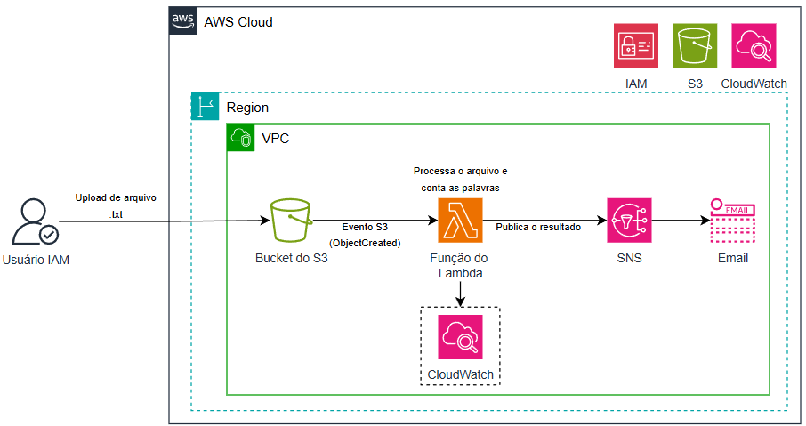
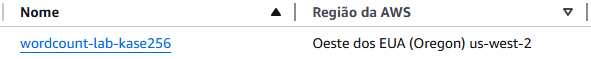
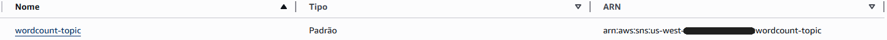
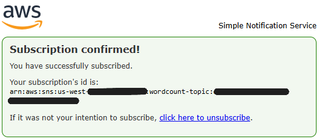
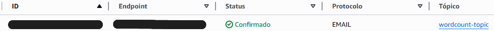
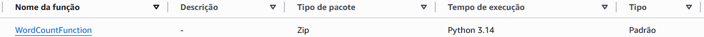
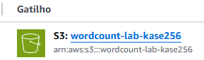
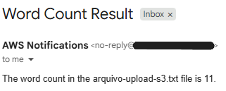

# Criando uma Função do Lambda


---

## Visão geral

Neste desafio implementei uma solução **serverless** utilizando serviços da AWS para automatizar a contagem de palavras em arquivos de texto.

O objetivo foi criar um fluxo totalmente automatizado onde, ao enviar um arquivo para um bucket do **Amazon S3**, uma função do **AWS Lambda** é acionada para processar o conteúdo do arquivo e calcular o número de palavras.

Após o processamento, o resultado é enviado automaticamente por e-mail através do **Amazon SNS**, sem necessidade de servidores ou intervenção manual.

Durante o processo, configurei integrações entre serviços gerenciados da AWS, permitindo a construção de uma arquitetura baseada em eventos, altamente escalável e de baixo custo.

---

## Arquitetura



Fluxo da aplicação:

1. Upload de arquivo `.txt` no **Amazon S3**
2. Evento dispara a função **AWS Lambda**
3. Lambda processa o arquivo e conta as palavras
4. Resultado é enviado via **Amazon SNS (email/SMS)**

---

## Serviços utilizados

- AWS Lambda  
- Amazon S3  
- Amazon SNS  
- AWS Identity and Access Management (IAM)  
- Amazon CloudWatch  

---

## Ambiente utilizado

- Python 3.14 
- Console de Gerenciamento da AWS  
- Arquivos de texto (.txt)  

---

## Etapas do laboratório

### 1. Criação do bucket no Amazon S3

Criei um bucket para armazenar os arquivos de texto que irão acionar automaticamente a função Lambda.

| Configuração | Valor |
|---|---|
| Nome | wordcount-lab-kase256 |
| Região | mesma do laboratório |



---

### 2. Criação do tópico no Amazon SNS

Criei um tópico para envio das notificações com o resultado da contagem.

| Configuração | Valor |
|---|---|
| Tipo | Padrão |
| Nome | wordcount-topic |




---

### 3. Criação da assinatura de e-mail

Configurei uma inscrição no tópico SNS para receber os resultados por e-mail.

| Configuração | Valor |
|---|---|
| Protocolo | Email |
| Endpoint | *email privado* |

⚠️ Foi necessário confirmar a inscrição no e-mail para ativar o envio.



#### 3.1 Inscrição confirmada no Console de Gerenciamento da AWS



---

### 4. Criação da função AWS Lambda

Criei uma função Lambda responsável por processar os arquivos enviados ao S3.

| Configuração | Valor |
|---|---|
| Nome | WordCountFunction |
| Runtime | Python 3.14 |
| Permissões | LambdaAccessRole |

Essa função tem permissão para acessar:

- Arquivos no S3  
- Enviar mensagens pelo SNS  
- Registrar logs no CloudWatch  



---

### 5. Configuração do gatilho (Trigger)

Configurei o bucket S3 para acionar automaticamente a função Lambda sempre que um arquivo for enviado.

| Configuração | Valor |
|---|---|
| Serviço | Amazon S3 |
| Bucket | wordcount-lab-kase256 |
| Evento | PUT (upload de arquivo) |



---

### 6. Implementação do código da função Lambda

A função executa as seguintes ações:

- Lê o arquivo enviado ao S3
- Conta a quantidade de palavras
- Envia o resultado por e-mail via SNS

```python
import json
import boto3
import urllib.parse

sns = boto3.client('sns')

TOPIC_ARN = "ARN_DO_TOPICO_SNS"

def lambda_handler(event, context):

    s3 = boto3.client('s3')

    bucket = event['Records'][0]['s3']['bucket']['name']
    key = urllib.parse.unquote_plus(event['Records'][0]['s3']['object']['key'])

    response = s3.get_object(Bucket=bucket, Key=key)

    text = response['Body'].read().decode('utf-8')

    word_count = len(text.split())

    message = f"The word count in the {key} file is {word_count}."

    sns.publish(
        TopicArn=TOPIC_ARN,
        Message=message,
        Subject="Word Count Result"
    )

    return {
        'statusCode': 200,
        'body': message
    }
```
---

### 7. Teste da solução

Criei um arquivo de teste com o seguinte conteúdo:

```
O AWS Lambda é um serviço de computação sem servidor poderoso.
```

Depois fiz o upload no bucket S3, o que acionou automaticamente todo o processo.

---

### 8. Verificação do resultado

Após o envio do arquivo:

- A função Lambda foi executada automaticamente
- O conteúdo foi processado
- Recebi um e-mail com o resultado



---

## Aprendizados

Durante este laboratório desenvolvi conhecimentos práticos sobre arquiteturas serverless e integração de serviços AWS baseada em eventos.

Os principais aprendizados foram:

Criação de funções serverless com AWS Lambda
Integração entre S3, Lambda e SNS
Automação baseada em eventos (event-driven architecture)
Uso de permissões IAM para comunicação entre serviços
Processamento de arquivos diretamente no S3
Monitoramento de execuções com CloudWatch

---

## Resultados

Ao final do laboratório consegui:

Criar uma função Lambda em Python para processamento de arquivos
Configurar um bucket S3 para acionar eventos automaticamente
Implementar envio de notificações via Amazon SNS
Construir um fluxo automatizado sem uso de servidores
Validar a solução com testes reais de upload e processamento