# Deploy de Aplicação Web em Instância EC2 (Challenge Lab)


---

## Visão geral

Neste desafio implementei uma aplicação web utilizando uma **instância Amazon EC2** executando **Amazon Linux**.

O objetivo foi criar manualmente toda a infraestrutura necessária para hospedar um site na nuvem. Isso inclui a configuração da rede, regras de segurança e a instalação de um servidor web responsável por disponibilizar a página para acesso pela internet.

Durante o processo, criei uma **VPC personalizada**, configurei **sub-rede, Internet Gateway e tabela de rotas**, e iniciei uma **instância EC2** dentro dessa rede. Para automatizar a configuração do servidor, utilizei o recurso **User Data**, que executa comandos automaticamente na primeira inicialização da máquina.

Ao final do laboratório publiquei uma página HTML simples no servidor web e validei o funcionamento acessando o site através do **endereço IP público da instância**.

---

## Arquitetura

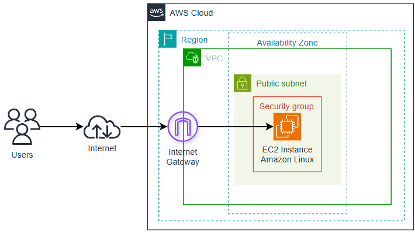

Arquitetura demonstra uma instância Amazon EC2 em uma subnet pública dentro de uma VPC. 
O acesso à instância é realizado através da internet utilizando um Internet Gateway.

---

## Serviços utilizados

- Amazon EC2
- Amazon VPC
- Internet Gateway
- Security Groups
- EC2 Instance Connect
- Apache HTTP Server

---

## Ambiente utilizado

- Amazon Linux
- Terminal Linux
- HTML
- EC2 Instance Connect

---

## Etapas do laboratório

### 1. Criação da VPC

Inicialmente criei uma **VPC personalizada** para hospedar os recursos do laboratório.

Configuração utilizada:

| Configuração | Valor |
|---|---|
| Nome | restart-vpc |
| IPv4 CIDR | 10.0.0.0/16 |

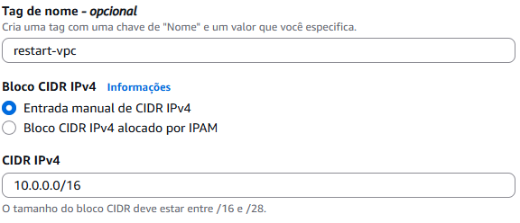
---

### 2. Criação da Subnet

Dentro da VPC criei uma **sub-rede pública** para hospedar a instância EC2.

| Configuração | Valor |
|---|---|
| Nome | restart-subnet |
| CIDR | 10.0.1.0/24 |
| Zona de disponibilidade| Sem preferência |

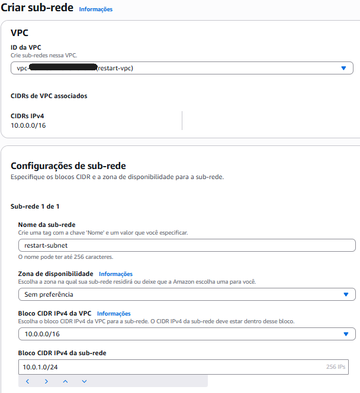
---

### 3. Configuração do Internet Gateway

Para permitir acesso à internet:

- Criei um **Internet Gateway**
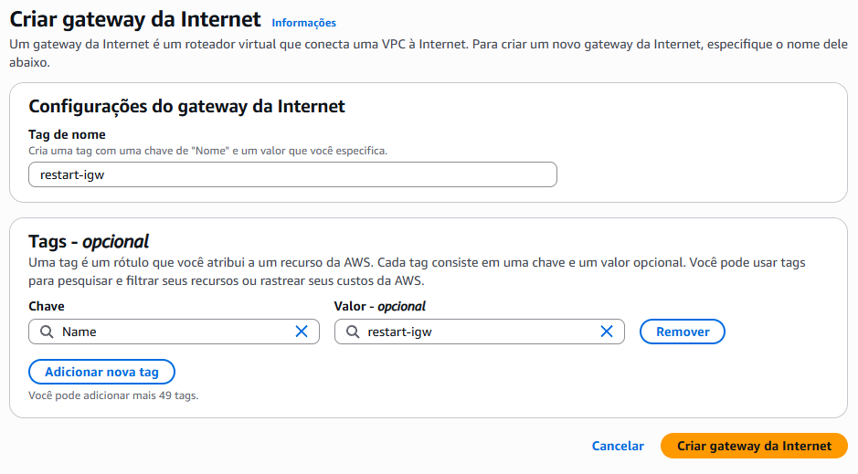

- Associei o gateway à **VPC**
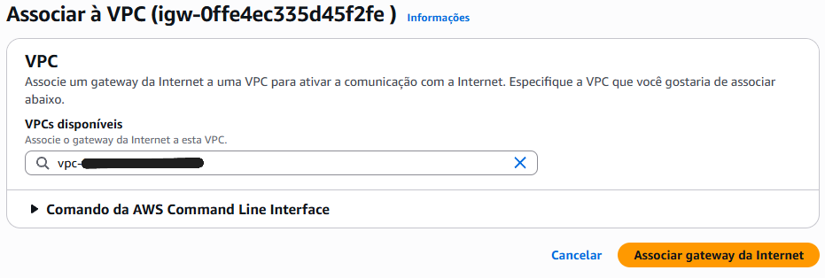

- Configurei a **tabela de rotas** para permitir tráfego externo
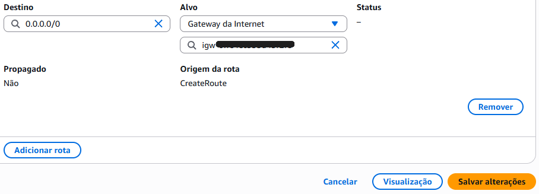

---

### 4. Criação do Security Group

Configurei um **Security Group** para controlar o acesso à instância EC2.

Regras de entrada configuradas:

| Tipo | Porta | Origem |
|---|---|---|
| SSH | 22 | Qualquer local-IPv4 |
| HTTP | 80 | Qualquer local-IPv4|

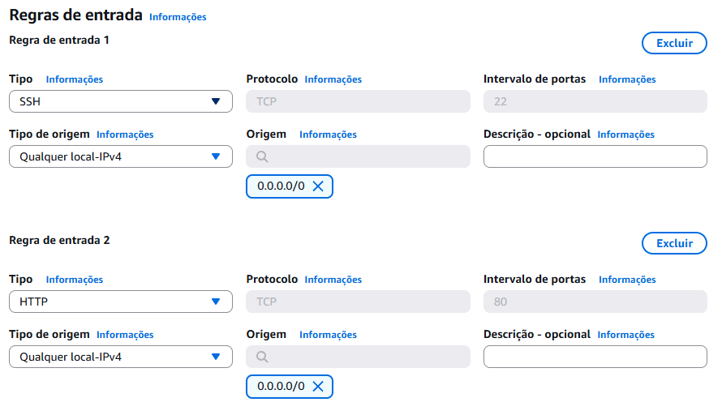

---

### 5. Criação da Instância EC2

Em seguida iniciei uma instância **Amazon Linux** utilizando o **Console de Gerenciamento da AWS**.

Principais configurações:

| Configuração | Valor |
|---|---|
| Nome | restart-ec2 |
| AMI | Amazon Linux |
| Tipo de instância | t3.micro |
| VPC | restart-vpc |
| Subnet | restart-subnet |
| IP público | habilitado |

Armazenamento utilizado:

| Volume | Tipo | Tamanho |
|---|---|---|
| Root | gp2 | padrão |

Configuração de rede da instância do EC2

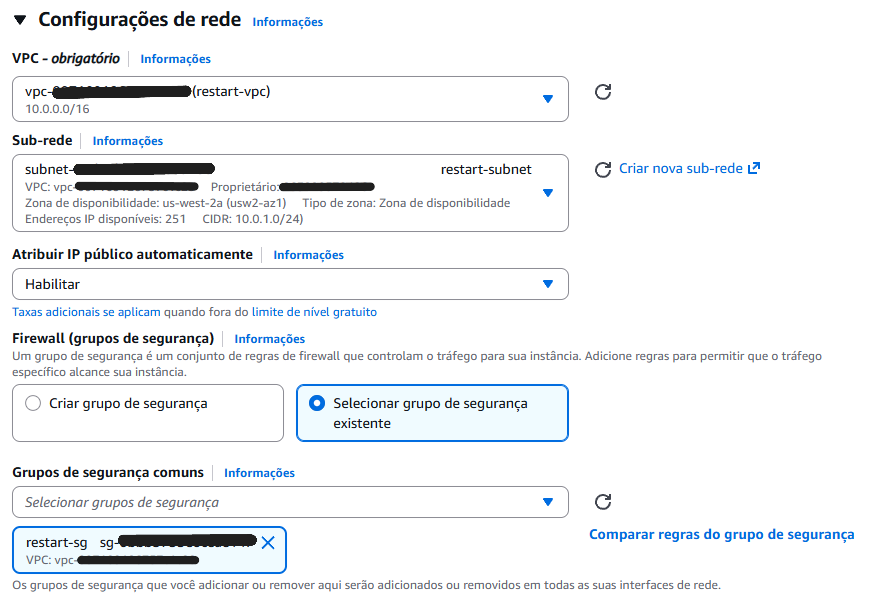

---

### 6. Configuração do User Data

Durante a criação da instância utilizei **User Data** para automatizar a instalação do servidor web Apache.

```bash
#!/bin/bash
yum update -y
yum install httpd -y

systemctl start httpd
systemctl enable httpd

chmod -R 777 /var/www/html
```

Esse script realiza:
- Instalação do Apache
- Inicialização do serviço
- Habilitação no boot
- Permissão de escrita no diretório web

### 7. Verificação do log do sistema

Após a inicialização da instância, consultei o System Log da instância EC2 para verificar se o Apache foi instalado com sucesso.

Foram identificadas mensagens confirmando:
- Instalação do pacote httpd

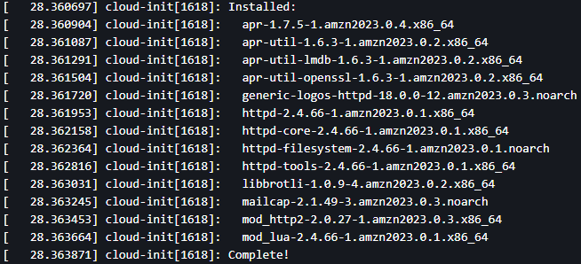

- Inicialização do serviço


### 8. Conexão à instância

Utilizei o EC2 Instance Connect para acessar a instância diretamente pelo navegador.

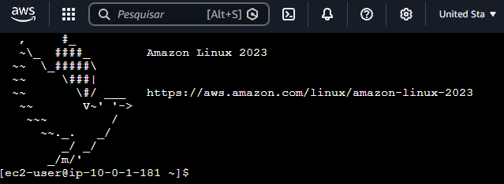

Isso permitiu executar comandos Linux no servidor para implantar a aplicação

### 9. Criação da página web

No terminal da instância criei o arquivo HTML:

```bash
nano projects.html
```
Conteúdo da página:

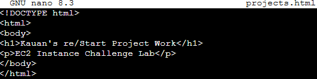

### 10. Publicação da página

Depois movi o arquivo para o diretório do servidor web:

```bash
sudo mv projects.html /var/www/html/
```
### 11. Teste da aplicação

Por fim acessei o site utilizando o IPv4 público da instância:

```bash
http://IP-DA-INSTANCIA/projects.html
```

A página foi exibida corretamente no navegador.

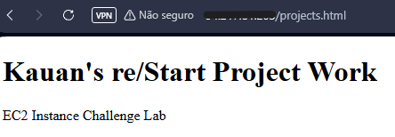

## Aprendizados

Durante este laboratório desenvolvi conhecimentos práticos sobre provisionamento de infraestrutura e implantação de aplicações em instâncias EC2. 

Os principais aprendizados foram:

- Configuração manual de uma VPC e sub-rede
- Criação e configuração de Internet Gateway e rotas
- Controle de acesso utilizando Security Groups
- Provisionamento e gerenciamento de instâncias EC2
- Automação de configuração usando User Data
- Instalação e execução de servidor web Apache
- Implantação de uma aplicação web em ambiente Linux

## Resultados

Ao final do laboratório consegui:

- Criar uma infraestrutura de rede completa utilizando Amazon VPC
- Implantar uma instância EC2 configurada automaticamente com Apache
- Publicar uma página web HTML em um servidor Linux
- Validar o funcionamento da aplicação acessando o servidor via HTTP público